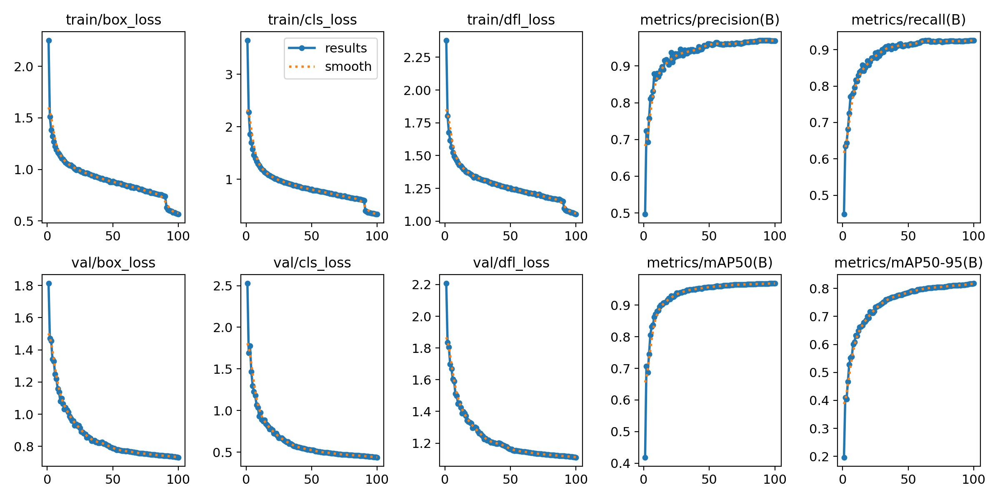

# PikaVision

## Requirements:
  All requirements are listed in the requirements.txt file. 
  Before installing requirements it is recommended to setup a python virtual environment. 
  To setup the environment run the following commands:
  > python3 -m venv venv
  To activate the environment(Linux): 
  > source venv/bin/activate

  To install all the requirements:
  > pip install -r requirements.txt

## Usage 
All of our work is shown in the **project2.ipynb** file. 

For simplicity, we compiled everything required for using the model into the **project2_doc.py** file. 

This file implements a simple CLI for running images and videos through the model. It also has an option for livestream if your machine supports it. 

To run the file: 
> python3 project2_doc.py

## Loss Curves

## Documentation 
All functions are documented in the **project2_doc.html** file. 
This was automatically generated using pydoc.

## Dataset
The dataset that we used to train the model can be found at the below link:
https://app.roboflow.com/pikavision/project2-dataset/3

## Latest model:
location: runs/detect/5_categories_no_aug/weights/best.pt

Latest model is trained, tested, and implemented in **project2.ipynb**.

For just using the model, refer the to **usage** section.

This is trained on the dataset found at the link below. 
No augmentation was applied to the dataset before training. 

We trained the model with augmentation as well. Unfortunately, there was little improvement for the large increase int training time. 

Full dataset with no augmentation: https://app.roboflow.com/pikavision/project2-dataset/3

### Results

| Class      | Images | Instances | Precision (P) | Recall (R) | mAP@50 | mAP@50-95 |
|------------|--------|-----------|---------------|------------|--------|-----------|
| All        | 973    | 1019      | 0.937         | 0.948      | 0.968  | 0.811     |
| Cat        | 117    | 117       | 0.967         | 0.995      | 0.995  | 0.923     |
| Dog        | 241    | 241       | 0.967         | 0.979      | 0.993  | 0.867     |
| Drone      | 232    | 244       | 0.965         | 0.963      | 0.990  | 0.702     |
| Person     | 194    | 361       | 0.824         | 0.823      | 0.877  | 0.699     |
| Pikachu    | 56     | 56        | 0.965         | 0.978      | 0.986  | 0.860     |

